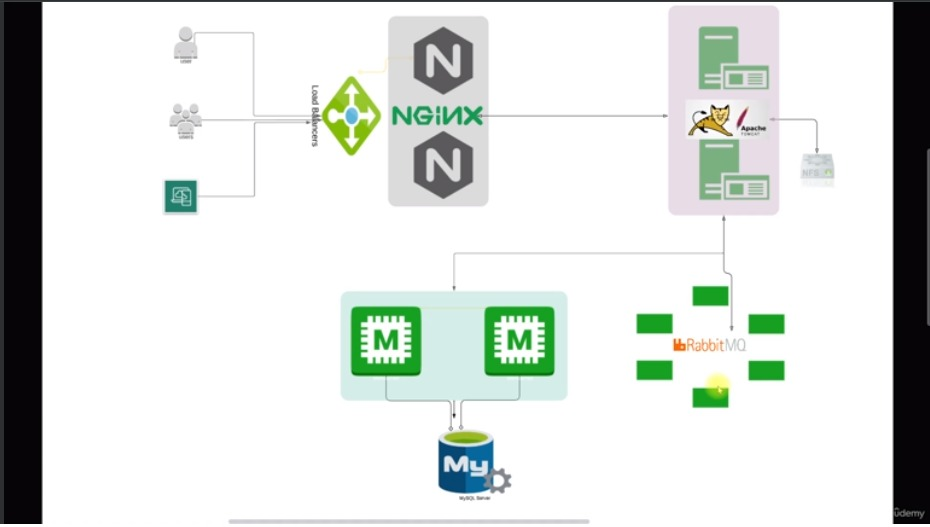

## **Configuration du projet VProfile Manuel et automatisé**

+ Bienvenue dans la section projet. Nous avons un produit appelé `VProfile`. Il s'agit d'un site Web écrit en `Java`, composé de plusieurs services.

+ On déploie ce produit sur cinq machines virtuelles. Comme le ca `WordPress`, `Apache` et le service `MySQL` exécutés sur la même Machine Virtuelle(VM).***

+ Ici, nous aurons services en cours d'exécution dans cinq machines virtuelles différentes. En temps réel, nous travaillerons sur un produit et nous devrons en avoir une copie locale du produit où nous pourons faire vos expériences.

***Ce projet est créé en gardant ce scénario à l'esprit.***

## Introduction

#### **1) À propos du projet**

+ Pile d'applications Web à plusieurs niveaux
+ Configuration sur ordinateur portable/de bureau
+ Base de référence pour les projets à venir
+ Vous aide à configurer n'importe quel projet localement

#### **2) SCÉNARIO**
+ Travailler dans un projet.
+ Variétés de services qui alimentent l'exécution de votre projet.
+ Document RunBook/Installation

#### **3) Problème**
+ Pas à l'aise pour effectuer des modifications sur de vrais serveurs.
+ La configuration locale est complexe.
+ Cela prend du temps.
+ Non reproductible.

#### **4) Objectif**
+ Automatisation `VIM` localement
+ Base de référence pour les projets à venir
+ Configuration de projets du monde réel localement [Pour la R&D]

#### **5) PROJET VPROFIL**
**A) Architecture des services de projet**

   + `NGINX`
   + `TOMCAT`
   + `RABBITMQ`
   + `MEMCACHED`
   + `MYSQL`

**B) Architecture de la configuration automatisée**

   + `VAGRANT`
   + `VIRTUALBOX`
   + `GIT BASH`

## Projet & Resultat - Manuellement (VM)

